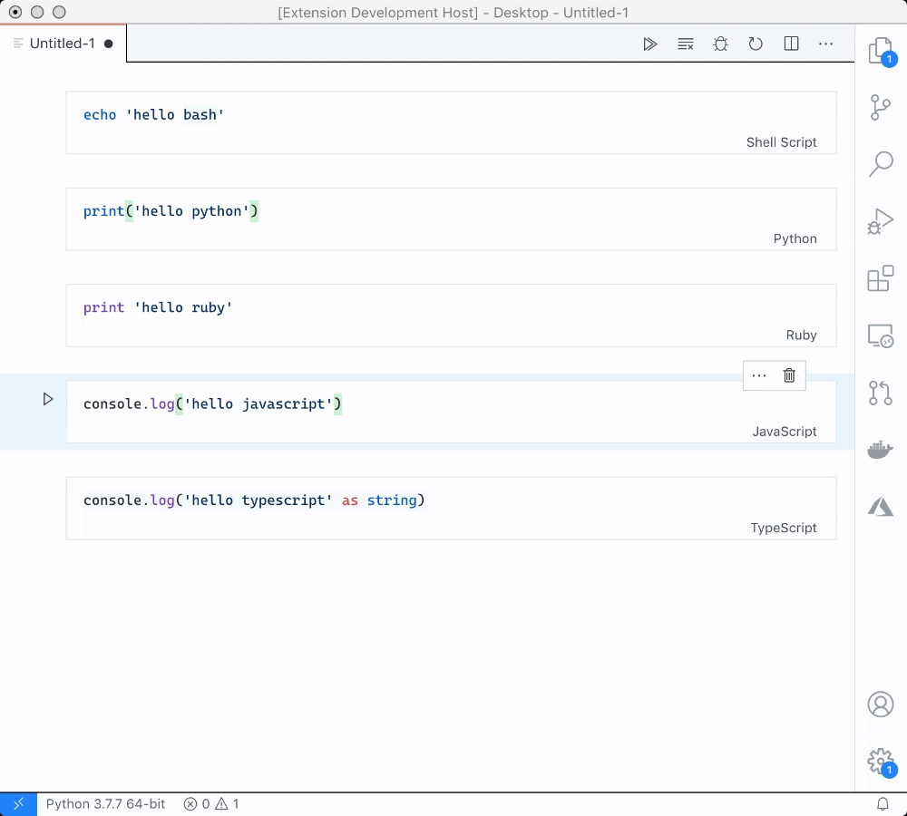

#  Handy Dandy Notebook - VS Code

Execute cells in bash, JavaScript, TypeScript, Ruby, or Python.

Provides the command: `New Handy Dandy Notebook` to open a new untitled notebook. Also opens `.hdnb` files by default, and opens `.md` files via the `View: Reopen Editor With...` option.



## How It Works

Unlike some notebook implementations, the Handy Dandy Notebook does not share any state across cells. This means each time you execute a cell, it runs in a brand new context, totally isolated from the rest of the cells.

## Config

### handydandy-notebook.dispatch

Used to configure how to execute cells. Array where the first element is the program to launch and second argument is array of arguments to pass. The string `${code}` in a an argument will be substituted for the cell contents.

Default:
```json
{
"python": [ "python", [ "-c", "${code}" ] ],
"typescript": [ "ts-node", [ "-T", "--skip-project", "-e", "${code}" ] ],
"javascript": [ "node", [ "-e", "(async () => { ${code} } )()" ] ],
"ruby": [ "ruby", [ "-e", "${code}" ] ],
"shellscript": [ "bash", [ "-c", "${code}" ] ],
"bash": [ "bash", [ "-c", "${code}" ] ]
}
```